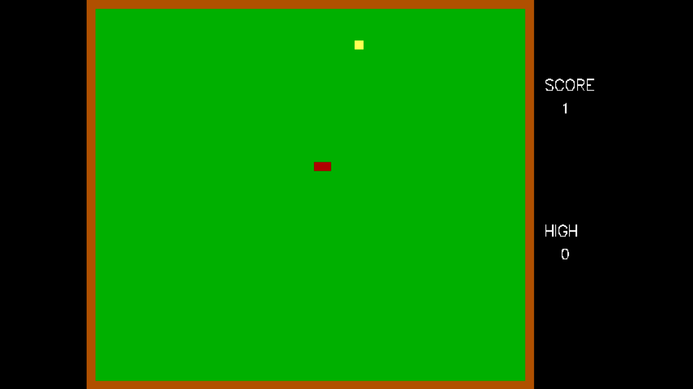
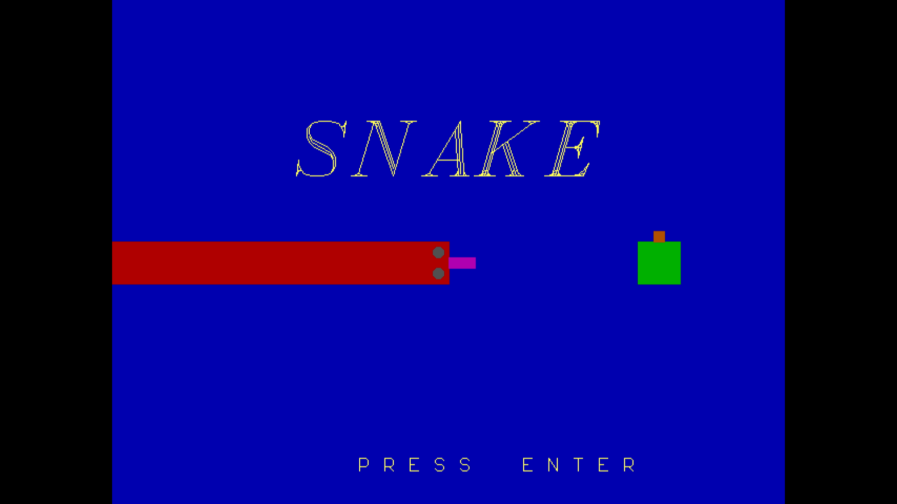
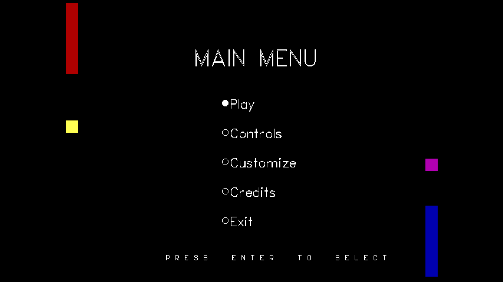
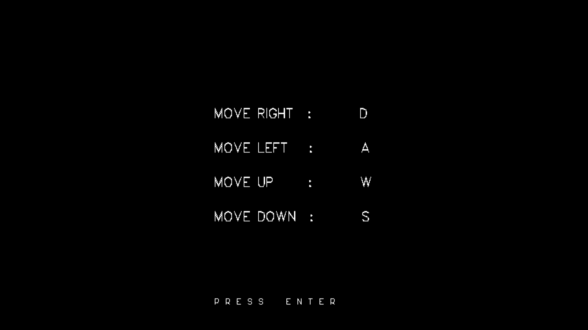
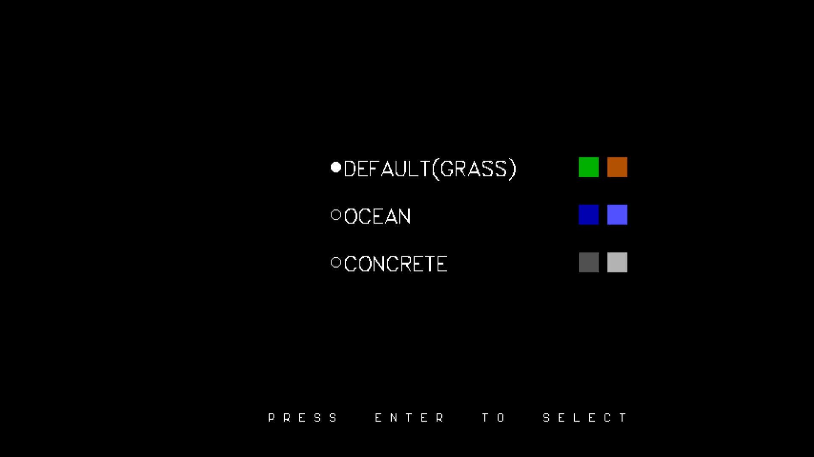
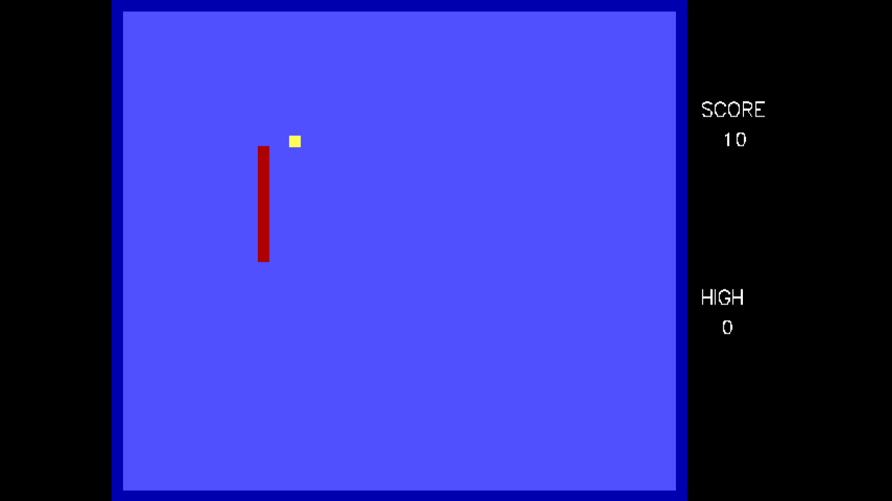
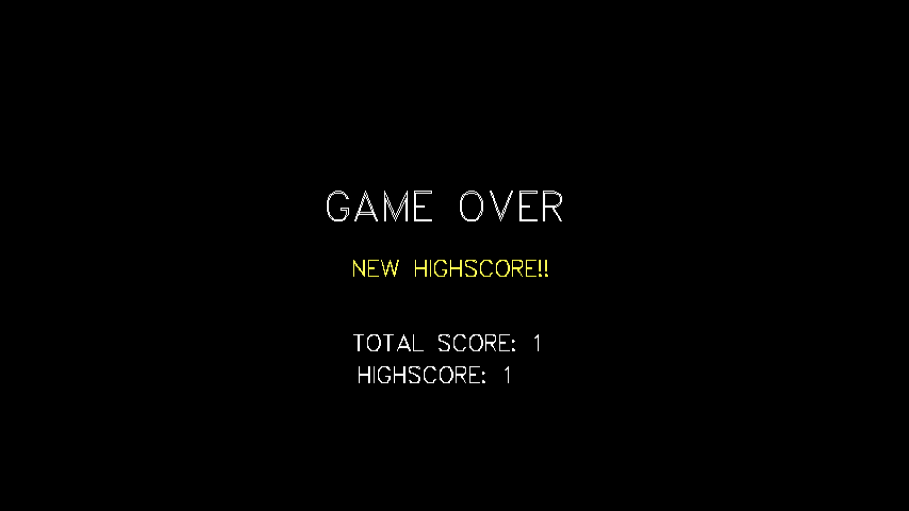
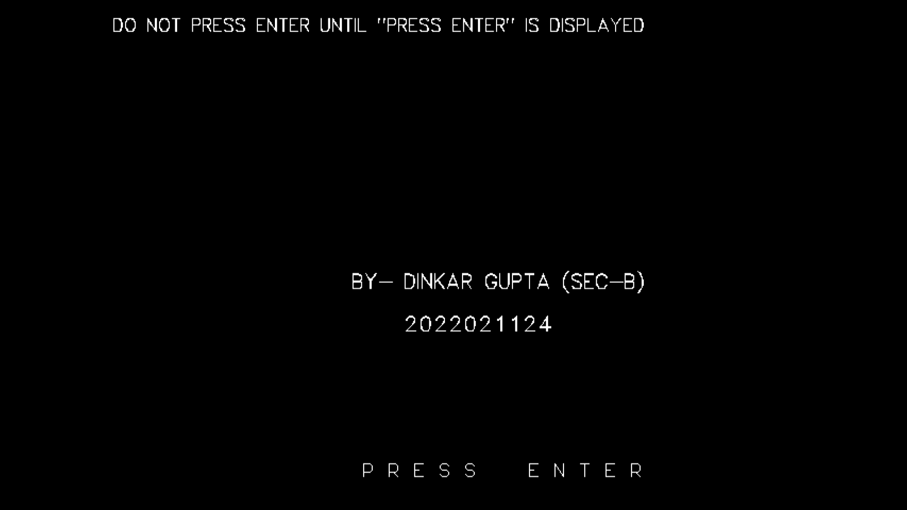

# C Snake Game

A simple snake game implemented in C using Turbo C++ v3.2.

## About

This project is a classic snake game built in C. The game allows the player to control a snake, navigate through the screen, and eat food to grow in size with increasing difficulty in terms of speed. The goal is to achieve the highest score possible without running into the walls or the snake's own body.

## Instructions to Run

To run this C snake game, you need to download and set up Turbo C++ v3.2.

### Steps:

1. *Download Turbo C++ v3.2*:
   - You can download Turbo C++ v3.2 from [this link](https://developerinsider.co/download-turbo-c-for-windows-7-8-8-1-and-windows-10-32-64-bit-full-screen/).

2. *Install Turbo C++ v3.2*:
   - Follow the installation instructions provided on the download page.

3. *Clone this Repository*:
   - Open your terminal or command prompt.
   - Clone the repository using the following command:
     sh
     git clone https://github.com/Dinkar850/Snake-Game.git
     
     

4. *Open the Project in Turbo C++*:
   - Launch Turbo C++.
   - Open the *SNAKE.C* file containing the snake game code from the cloned repository.

5. *Compile and Run the Game*:
   - Compile the code by going to Compile > Compile.
   - Run the game by going to Run > Run.

## Features

- Classic snake game mechanics
- Simple and intuitive controls
- Different themes available for gameplay
- Increasing difficulty
- Score and High Score tracking

## Screenshots of the game
---

